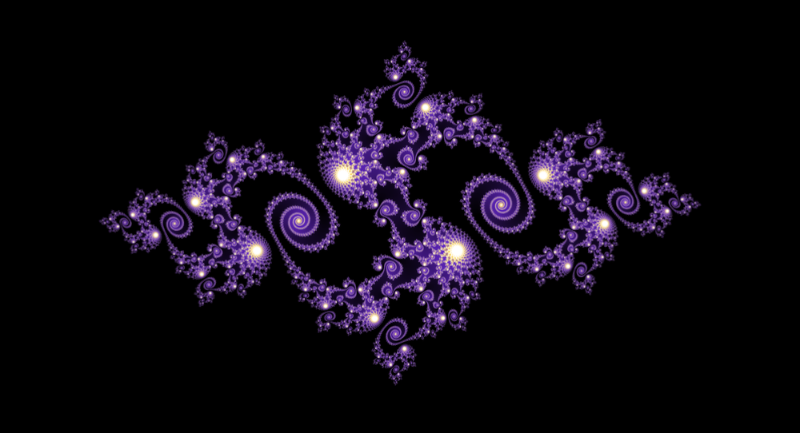

# Fractalisator

The project aims to create a lightweight Mandelbrot and Julia rendering program.

The rendering is parallelized and as modular as possible.

It is still in its early steps and only the fractal generating parts of code have been cleaned so far. The UI is currently only an alpha version of a prototype.
